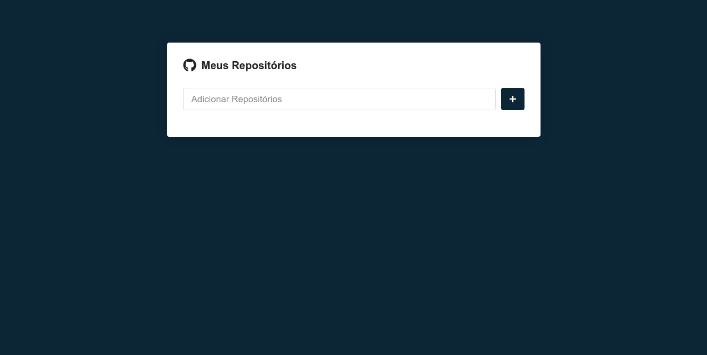
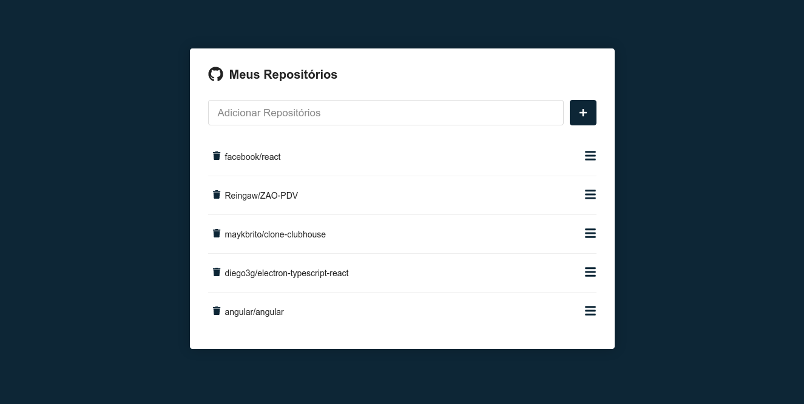
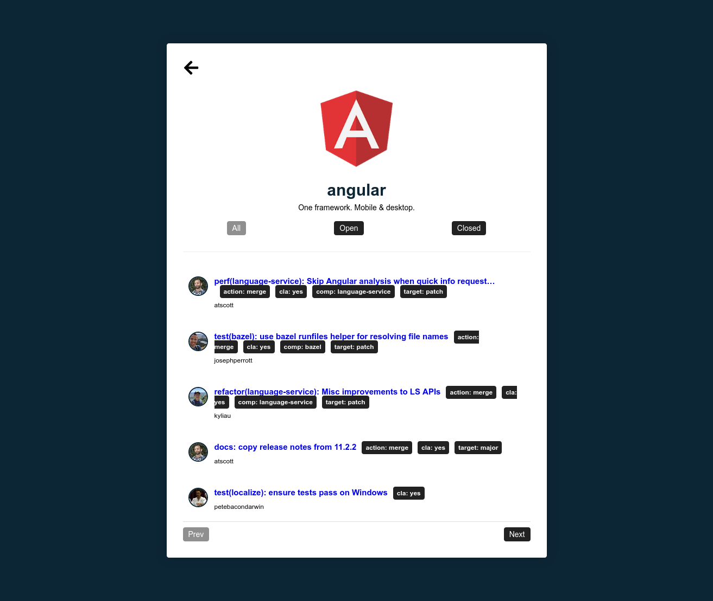

# What was used to build this project?

This project was built using:
- Javascript
- Styled-components
- Github API

# How to run this project

## Clone this project
```
git clone https://github.com/Reingaw/repository-finder.git
```
## Install the dependencies
```
npm install or yarn add
```

## Run this project
```
npm start or yarn run start
```

# How the project looks like

### Preview 1


### Preview 2


### Preview 3
